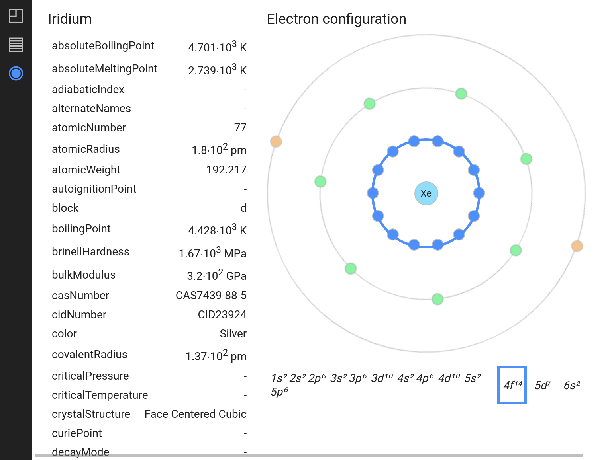

# Mendeleev

Graphical representation of periodic law, detail information about element, structured and ordered info about domain properties

<div style="display:flex; justify-content:space-around;">
  
  
  
</div>

## CLI Commands

```bash
# install dependencies
yarn

# serve with hot reload at localhost:3000
yarn start

# build for production with minification
yarn build

# test the code quality
yarn lint

# run tests
yarn test
```
